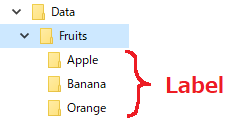

# ImageClassification
A NuGet package for image classification wrapper using ML.NET.
https://www.nuget.org/packages/ImageClassification/

# Usage

## Prepare

1. Prepare the foldered data as show below. 100 images of each is enough.



2. That's all!

For those who want to prepare their own images using a webcam, this repo is kindly provided.
https://github.com/teonsen/WebcamImageClassification

## Train and generate the model
```csharp
using ImageClassification;

// Define data-set folder.
string dataDir = @"C:\Data\Fruits";
            
// Define hyper-paramters such as Epoch or BatchSize.
var hp = new HyperParameter {
    Epoch = 200,
    BatchSize = 10,
    LearningRate = 0.01f,
    eTrainerArchitecture = eTrainerArchitectures.ResnetV250,
    TestFraction = 0.3f
};

// Train and generate the model.
var resultFile = Trainer.GenerateModel(dataDir, hp);
```
Once you run the code above, pipeline.zip and model.zip will be created in the dataset folder.

## Classify
To predict an image, pass the pipeline and model.zip output by Trainer.GenerateModel() above, as well as the image file, to the following function.
```csharp
// Classify the single image.
string imageToClassify = @"C:\your\imageToClassify(apple_or_banana_or_orange).png";
var prediction = Predictor.ClassifySingleImage(resultFile.PipelineSavedPath, resultFile.ModelSavedPath, imageToClassify);
Console.WriteLine($@"Predicted image label is: ""{prediction.PredictedLabel}"". Score:{prediction.Score}");
```

# Acknowledgements
* Most part of the code is originaly written by [@Hiromasa-Masuda](https://github.com/Hiromasa-Masuda)
* Thank you for all the effort to create ML.NET and SciSharp
